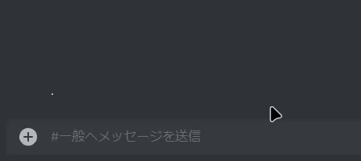

# Discord Markdown Cheatsheet

Discord で使える Markdown のチートシート

※例がありますが、Discord と Github では書き方が少し違うのでソースを見ると書き方が違う場合がある。

## 基礎

<details>
    <summary>もくじ</summary>
        1. <a href="#1">太字</a><br>
        2. <a href="#2">斜体</a><br>
        3. <a href="#3">下線</a><br>
        4. <a href="#4">コードブロック</a><br>
        5. <a href="#5">引用</a><br>
        6. <a href="#6">ネタバレ</a><br>
        7. <a href="#7">リスト</a><br>
        8. <a href="#8">タイトル</a><br>
        9. <a href="#9">取り消し線</a><br>
        10. <a href="#10">ハイパーリンク</a>
</details>

<h3 id="1">太字</h3>

アスタリスク(\*)2 つで太字にしたい部分を囲む

**こんなかんじ**

<h3 id="2">斜体</h3>

アンダーバー(\_)1 つで斜体にしたい部分を囲む

_like this_

<h3 id="3">下線</h3>

アンダーバー(2)2 個で下線を付けたい部分を囲む

<ins>こんなかんじ</ins>

<h3 id="4">コードブロック</h3>

バッククォート(`)1 個でミニ コードブロックにしたい部分を囲む

`こんなかんじ`

バッククォート(`)3 個でコードブロックにしたい部分を囲む

```js
console.log("こんなかんじ");
```

<h3 id="5">引用</h3>

引用文にしたい行の最初に「>」を置くことで引用文にできます。

> こんな感じ

<h3 id="6">ネタバレ</h3>

ネタバレ防止にしたい文字を「|」2 つで囲む



<h3 id="7">リスト</h3>

行の最初に「-」と入力してスペースを入れる

- こんなかんじ
- ハイフンの前にスペースを入れると一つ下げれる
- Discord では 2 つ以上下げることはできない。

ハイフンではなく、「1.」などと入力すると数字のリストが作れる。

1. 例えば
2. こんな
3. 感じ

<h3 id="8">タイトル</h3>

行の先頭に#を入れる

# こんなかんじ

## #を 2 つにしたり

### 3 つにできる。

#### Discord では 4 つ以降はない

<h3 id="9">取り消し線</h3>

取り消し線を引きたい文字をチルダ(~)2 つで囲む

~~こんなかんじ~~

<h3 id="10">ハイパーリンク</h3>

\[プレースホルダ?](URL)

こんな感じ: [My Homepage](https://070ry.pages.dev/home)

Discord ではできないが本来はネタバレ防止の場所でやっているように、画像を表示することもできる。

\![assets/spoiler.gif]\(assets/spoiler.gif)


一旦これまで。記述不足があるかもしれないので気づいた場合は issue を開いてほしい。

よく誤字ったりミスったりいろいろするのでその時もissueを開いてほしい。

ﾏﾀﾈヾ(≧▽≦\*)o
